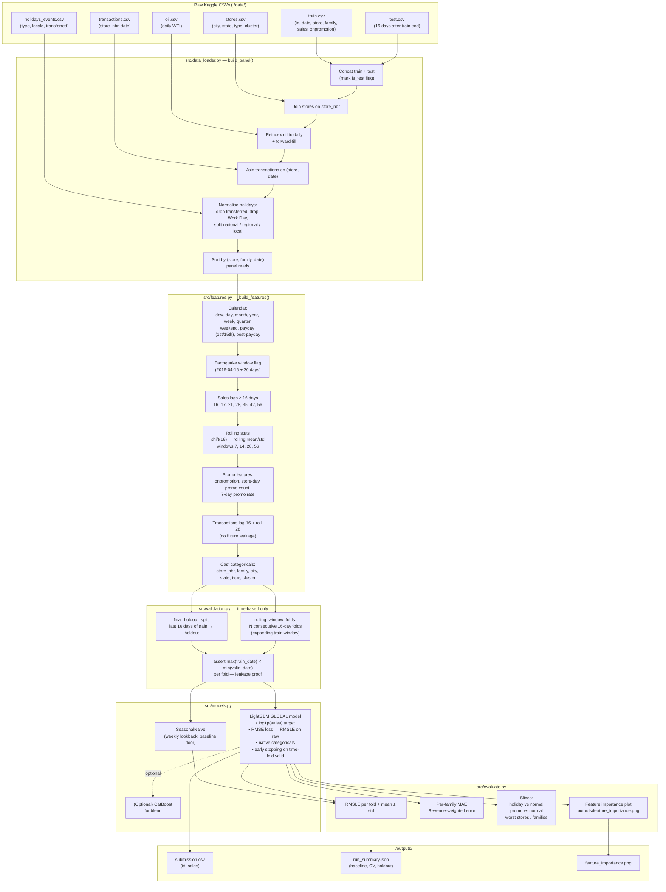

# Pipeline Architecture

## Pipeline stages (text)

1. **Load + merge.** `data_loader.build_panel()` concatenates train + test,
   joins stores on `store_nbr`, forward-fills oil to a daily index, joins
   transactions on (store, date), and normalises the holiday calendar
   (dropping `transferred=True` rows and `Work Day` rows, splitting the
   remaining holidays by `locale` into national / regional / local flags).
2. **Feature engineering.** `features.build_features()` adds calendar
   features, an earthquake-period flag, lag features ≥ 16 days, rolling
   means/stds that are shifted by 16 days *before* rolling (so the
   window never touches the prediction date), promo features, and lagged
   transactions. Identifier columns are cast to categorical for LightGBM.
3. **Time-based validation.** `validation.rolling_window_folds()` produces
   N consecutive 16-day folds stepping backward from train end with an
   expanding train window. Each fold asserts
   `max(train_date) < min(valid_date)`. `validation.final_holdout_split()`
   carves the last 16 days for a Kaggle-mirroring holdout.
4. **Models.** A seasonal-naive baseline sets the floor (weekly lookback).
   Then one global LightGBM is trained on `log1p(sales)` with RMSE loss
   (mathematically equivalent to RMSLE on the raw scale), with the six
   identifier columns as native categoricals and early stopping on each
   fold's valid set. CatBoost is wired up but optional.
5. **Predict.** After CV we refit on **all** training data using the
   median `best_iteration` from the holdout, predict the 16-day Kaggle
   window, `expm1` back to the raw scale, clip negatives to zero, and
   write `outputs/submission.csv`.
6. **Error analysis.** `evaluate` slices the holdout error by family,
   by store, holiday vs. non-holiday, and promo vs. non-promo; plots
   feature importance; reports revenue-weighted MAE alongside RMSLE.
